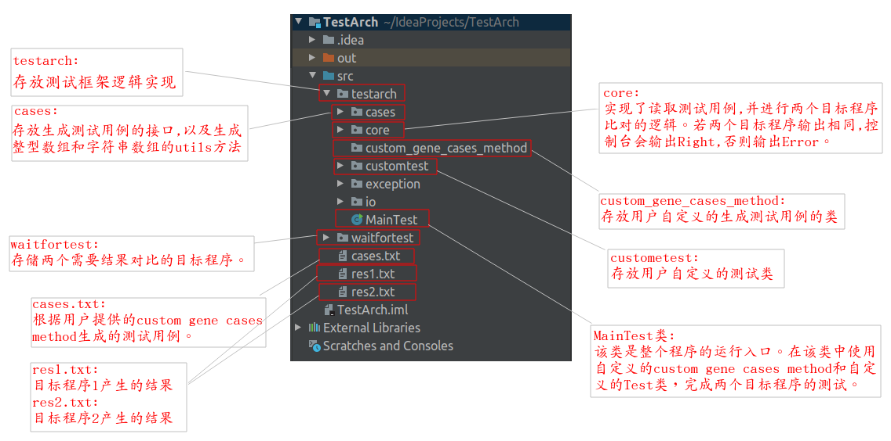

# 0.TestArch简介
在LeetCode上或者其他Oj系统中刷题时，如何快速判定程序的正确性。本项目对程序的正确性进行了一定程度的测试。首先我们可以写出一个枚举的算法，不要求该算法时间复杂度小，但一定要保证该算法的正确性。通常枚举算法是容易实现的。然后再写出一个优化后的算法，我们通过本测试框架可以测试出两个目标程序是否结果一致。当然测试用例的一定要保证在枚举算法中能够快速输出。最后对于一些边界值和测试用例进行针对性测试，基本就可以测试出程序的正确性。

# 1.包目录结构

# 2.测试框架使用步骤

1. 在`custom_gene_cases_method`包下，自定义custom gene cases method类
   1.1 自定义gene cases method类，并实现`ICasesGeneMethod`接口
   1.2 实现`ICasesGeneMethod`接口中的`geneCases()`。该方法返回产生的测试用例。
2. 在`customtest`下，自定义customtest测试类，并继承自`AbstractTestUtils`。该类需要传入自定义gene cases method类。
3. 将自定义gene cases method类 作为参数传递给 自定义customtest测试类。并调用自定义gene cases method类的run()方法。
4. 将两个目标程序拷贝进`waitfortest`目录下。并对该类稍作改动。
   4.1 使两个目标程序继承`BaseIO`
   4.2 注释掉新建Scanner对象语句。因为需要使用框架提供的Scanner类。否则报错。
5. 运行MainTest类即可看到比对结果。

# 3.补充

1. 该测试框架只能查到两个程序输出结果不一致的测试用例。

2. 当控制台打印Error，并抛出异常后，cases.txt中存储的就是结果不一致的测试用例。

3. custom_gene_cases_method包中的类可以删除掉。

4. 为了节省测试效率，最好使用customtest包下提供的MyTest类进行测试。

# 4.注意
严格控制目标程序的输出。
差一点，哪怕多输出一个空格产生的不一致，也不能通过检测。
所以输出时，要严格把控输出。目标程序开发者应协商好。

【注意】为了方便将测试用例输出到文件中，测试用例集合中的元素最好保存成String类型。切记切记

# 5.代码说明

# 6.示例
程序默认提供了一个测试示例。运行MainTest即可

